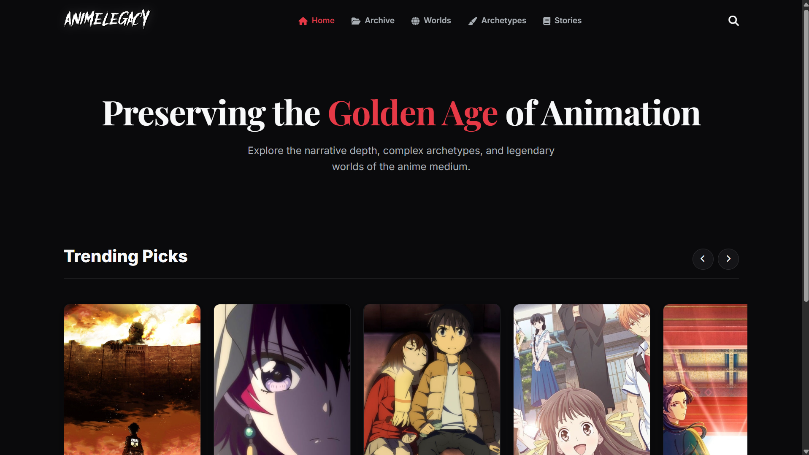
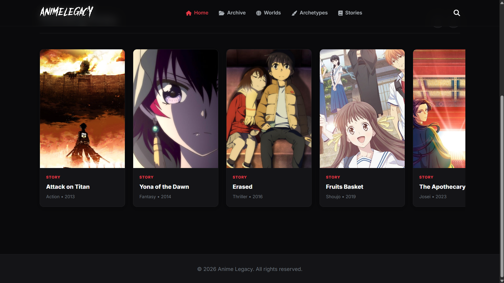
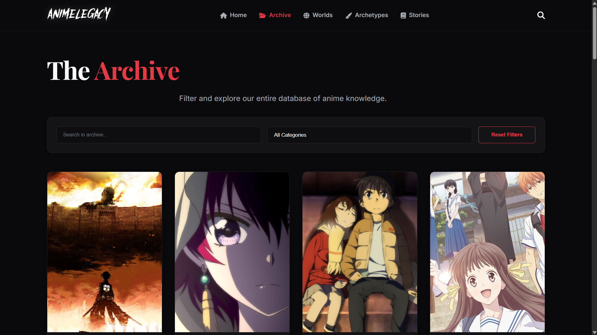
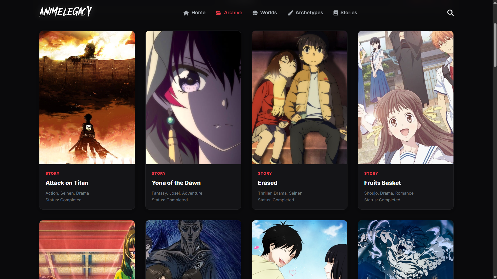
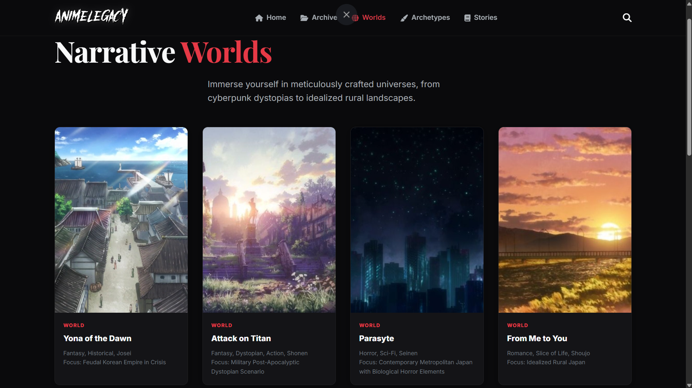
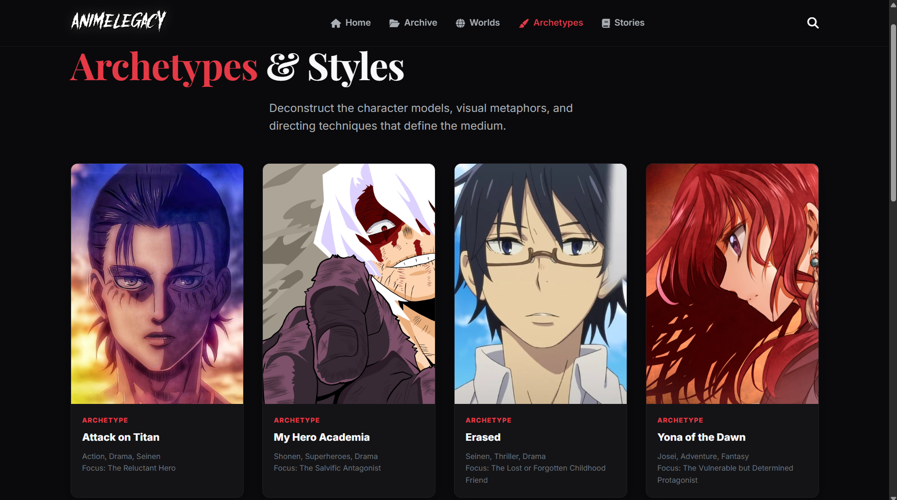
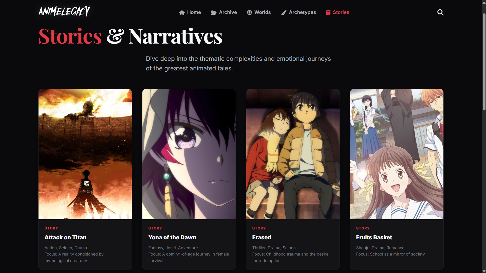
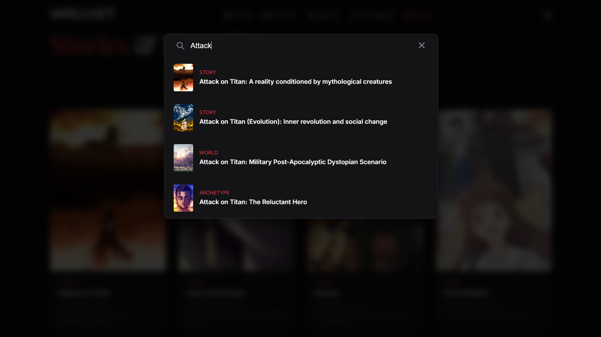

# Anime Legacy Platform 🎌 — Enterprise Multimedia Knowledge Platform

> Enterprise-grade frontend web application for exploring narrative depth, character archetypes, and legendary worlds of Japanese animation through modular client-side engineering.


---

# 🇬🇧 English Documentation

Anime Legacy Platform is a modular, performance-oriented, and enterprise-inspired frontend web application designed for the exploration, classification, and presentation of Japanese animation narratives, thematic archetypes, and fictional universes.

The platform demonstrates the evolution of a university multimedia assignment into a production-style frontend architecture centered on:

- modular component isolation
- maintainability
- client-side performance optimization
- scalable UI rendering
- immersive multimedia UX design
- asynchronous interaction systems

Developed as part of the **Progettazione e Produzione Multimediale (PPM)** curriculum at **Università degli Studi di Bari Aldo Moro** (A.Y. 2024/2025).

---

# 🚀 Core Engineering Highlights

## 📦 Modular Vanilla Architecture

The application adopts a modular ES6 component architecture designed to isolate rendering pipelines, interaction logic, and data services from the global execution scope.

Core modules include:

- search.js
- carousel.js
- api.js
- page-specific controllers
- reusable utility helpers

This structure minimizes global namespace pollution while improving scalability, maintainability, and component reusability across the platform.

The architecture follows a lightweight event-driven design philosophy without requiring external frontend frameworks.

---

## ⚡ Simulated Database & API Abstraction Layer

Data interactions are centralized through a dedicated mock API service interfacing with a structured local object store (`database.js`).

The abstraction layer implements:

- asynchronous data retrieval workflows
- modular export/import systems
- standardized entity querying
- centralized filtering pipelines
- exception-safe data handling

Example architecture pattern:

```javascript
export const getItemsByCategory = (category) => {
  return database.filter((item) => item.category === category);
};
```

This approach simulates production-oriented frontend/backend separation while preserving lightweight deployment requirements.

---

## 🔍 Real-Time Global Search Engine

The platform integrates a highly responsive client-side search engine optimized for instant interaction feedback and dynamic content discovery.

### Search Modal (search.js)

The live-search system provides:

- asynchronous keystroke detection
- dynamic dropdown rendering
- debounced input listeners
- instant entity suggestions
- deep-linking to detailed content pages

Example route pattern:

```text
detail.html?id=entity_id
```

### Global Archive (archive.html)

The archive system acts as a centralized exploration hub supporting:

- cross-category navigation
- advanced filtering workflows
- thematic classification
- scalable entity rendering

---

## 🎨 Thematic UI & Visual State Management

The frontend interface implements a cinematic and immersive design system inspired by modern multimedia platforms.

Core UI engineering features include:

- CSS Custom Properties for centralized visual state management
- CSS Grid and Flexbox responsive layouts
- semantic HTML5 accessibility structures
- animated hover transitions
- blur and zoom micro-interactions
- optimized visual hierarchy systems

---

## ⚙️ Zero-Dependency Frontend Engine

The frontend runtime is intentionally lightweight, dependency-free, and optimized for native browser execution.

Implemented features include:

- Vanilla JavaScript (ES6+)
- asynchronous interaction pipelines
- optimized DOM node generation
- event delegation systems
- native Browser API integrations
- modular rendering controllers

No external frameworks (such as React, Vue, or Angular) are required, significantly reducing dependency overhead and improving maintainability.

---

# 📁 System Architecture Tree

```text
anime-legacy-platform/
├── assets/
│   ├── css/
│   │   └── main.css              # Centralized Design System & UI Tokens
│   ├── img/                      # Multimedia Visual Assets
│   │   ├── anime/                # General anime series cover art and banners
│   │   ├── archetypes/           # Character archetype visual representations
│   │   └── stories/              # Narrative and thematic story artwork
│   └── js/
│       ├── components/
│       │   ├── carousel.js       # Dynamic Carousel Rendering Engine
│       │   └── search.js         # Real-Time Search Interaction System
│       ├── data/
│       │   └── database.js       # Simulated Structured Object Store
│       ├── pages/
│       │   ├── archive.js        # Complex archive filtering and grid logic
│       │   ├── category.js       # Dynamic category feed rendering controller
│       │   └── detail.js         # Single entity data hydration logic
│       ├── services/
│       │   └── api.js            # Mock API Abstraction Layer
│       ├── utils/
│       │   └── helpers.js        # Shared Utility Functions
│       └── app.js                # Global Frontend Bootstrap Controller
├── docs/
│   ├── academic_archive/         # Original Academic Documentation
│   └── assets/                   # Screenshots & Documentation Media
├── archetypes-styles.html        # Character Archetypes Interface
├── archive.html                  # Global Archive Exploration System
├── detail.html                   # Dynamic Entity Detail Renderer
├── index.html                    # Centralized Multimedia Dashboard
├── narrative-worlds.html         # Narrative Worlds Showcase
└── stories.html                  # Stories & Narrative Structures
```

---

# 📸 Application Previews

<details>
<summary><b>Click to expand screenshots</b></summary>

|                          Main Dashboard                           |                            Trending Carousel                             |
| :---------------------------------------------------------------: | :----------------------------------------------------------------------: |
|  |  |

|                            Global Archive                            |                            Archive Grid View                            |
| :------------------------------------------------------------------: | :---------------------------------------------------------------------: |
|  |  |

|                           Narrative Worlds                            |                             Archetypes & Styles                              |
| :-------------------------------------------------------------------: | :--------------------------------------------------------------------------: |
|  |  |

|                            Stories & Narratives                            |                           Global Search Modal                           |
| :------------------------------------------------------------------------: | :---------------------------------------------------------------------: |
|  |  |

</details>

---

# ⚙️ System Setup & Execution

## 1. Clone the Repository

```bash
git clone https://github.com/magronemichele/anime-legacy-platform.git
cd anime-legacy-platform
```

---

## 2. Configure the Data Layer

No SQL database configuration is required.

The platform uses a pre-configured structured object store located at:

```text
assets/js/data/database.js
```

---

## 3. Configure the Environment

No `.env` configuration is required.

The platform executes entirely client-side through native browser rendering engines.

---

## 4. Start the Local Development Server

Because the project utilizes ES6 Modules (`<script type="module">`), it must be served through HTTP to avoid browser CORS restrictions.

Run:

```bash
python -m http.server 8000
```

Or use VS Code Live Server.

---

## 5. Access the Application

```text
http://localhost:8000
```

---

# 🛡 Architecture & Performance Features

- ES6 module encapsulation
- asynchronous DOM rendering
- semantic HTML5 structuring
- event delegation systems
- optimized client-side filtering
- centralized visual state management
- dependency-free interaction logic
- native browser API integrations
- responsive multimedia rendering
- lightweight runtime architecture

---

# 📚 Technology Stack

| Layer           | Technology                    |
| --------------- | ----------------------------- |
| Architecture    | Component-based, Event-driven |
| Data Layer      | Simulated JSON Object Store   |
| Frontend Core   | HTML5, CSS3                   |
| Logic & Scripts | Vanilla JavaScript (ES6+)     |
| UI & Assets     | FontAwesome, Google Fonts     |
| Rendering Model | Client-side Dynamic Rendering |

---

# 📄 License & Academic Context

This project is provided exclusively for educational, architectural, and multimedia engineering reference purposes.

The platform originally served as an academic assignment for the **Progettazione e Produzione Multimediale (PPM)** course at the **Università degli Studi di Bari Aldo Moro**.

Before adapting the project for production-oriented deployments, ensure:

- frontend optimization auditing
- asset compression strategies
- accessibility validation
- production-grade hosting configuration
- browser compatibility verification

The original academic documentation archive is preserved within:

```text
docs/academic_archive/
```

The authors assume no liability for improper deployment, insecure modifications, or misuse in unmanaged environments.

---

# 👥 Authors & Academic Credentials

- **Michele Magrone** — Student ID: _778705_  
  `m.magrone11@studenti.uniba.it`

- **Giovanni Rutigliano** — Student ID: _781806_  
  `g.rutigliano33@studenti.uniba.it`

---

**Università degli Studi di Bari Aldo Moro**  
_Department of Computer Science (ITPS) — Academic Year 2024/2025_
